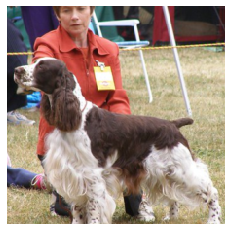
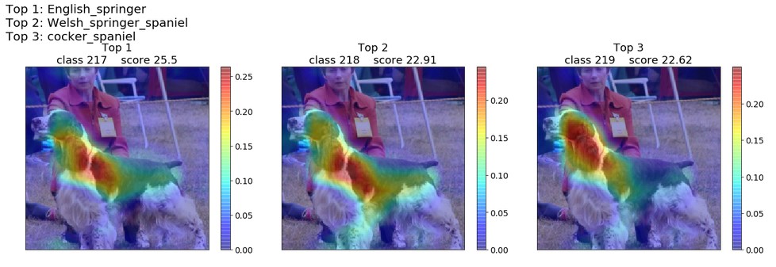

# GradCam
Pytorch implementation of the GradCam method to give visual explanations for neural network predictions. I did this as part of a class on Deep Learning in the [MVA](https://www.master-mva.com/) master's programm.

### Reference: 
Selvaraju, Ramprasaath R., et al. "Grad-cam: Visual explanations from deep networks via gradient-based localization." https://arxiv.org/pdf/1610.02391.pdf

### Example:
Input:

GradCam result:

